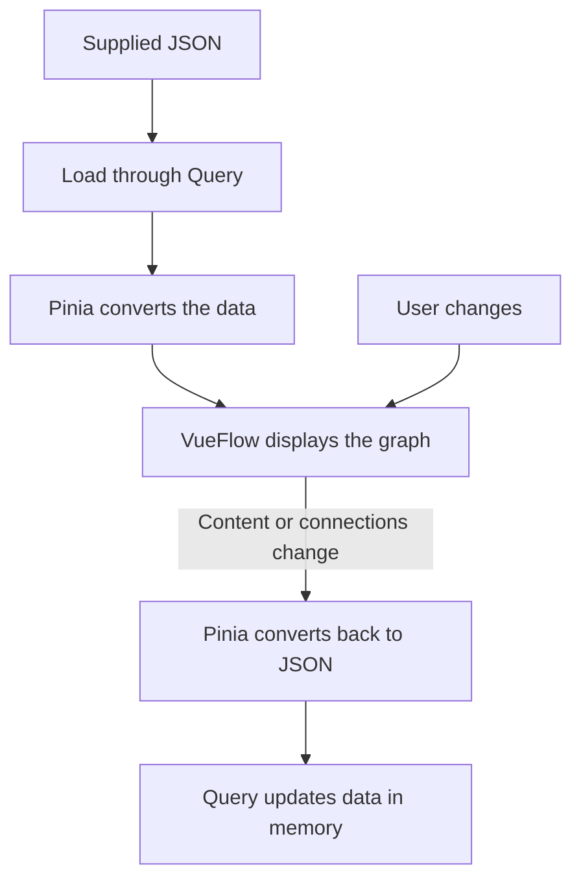

# Respond.io Flowchart App

This Vue 3 web app is a technical assessment project for Respond.io's Sr. Frontend Developer position.

## Technical Design Decisions

### Canvas and state

Pinia provides a central place to coordinate flow actions, history, and data conversion. It shares VueFlow's live nodes and connections, keeping one working graph. The drawback is that this coordination layer depends on VueFlow's data structure.

### Loading and saving

TanStack Query demonstrates data loading and updates, as required by the assessment. The current implementation uses an in-memory data source. This demonstrates the approach but does not show communication with a real server.

### Original data format

The app preserves the supplied JSON format and converts it into the format VueFlow needs. This keeps frontend changes from requiring backend changes, especially when several clients use the same backend. The drawback is extra conversion code that must preserve data and relationships correctly.



### Branch labels

Business-hours outputs appear as labeled lines because the assessment describes them as display-only branches. This follows the sample interface and keeps these outputs separate from editable actions. The drawback is extra work to preserve their original records while displaying them as lines. The current conversion supports only one connector between nodes; this is an implementation limit rather than a confirmed design choice.

### Automatic layout

Dagre was chosen because the VueFlow reference example uses it, with maintenance considered during selection. It arranges the initial graph automatically, but existing positions should remain unchanged when nodes are added or deleted. The current code still requests rearrangement after these actions, so preserving positions remains unfinished. The layout code is adapted from the [VueFlow Simple Layout example](https://vueflow.dev/examples/layout/simple.html).

### Forms and validation

Creation and editing reuse the same forms to reduce repeated code. Each form keeps its validation in a dedicated function, making responsibilities easier to find and understand. Zod was chosen based on prior experience, support from popular form libraries, and maintenance considerations. The drawback is that keeping form fields and their validation separate requires both to be updated together.

### Details and saving

Each node has its own URL so users can bookmark its details, as required by the assessment. Submitting edits creates a clear boundary for one undo action. The drawback is that users must submit their changes before they take effect.

### Undo and redo

VueUse's `useManualRefHistory` restores nodes and their connections together after completed actions, without recording selection changes as separate actions. Newly created nodes remain when older actions are undone, so users can recover deleted work without recreating their new nodes. The drawback is that creation behaves differently from other actions and cannot itself be undone.

### Storage and attachments

Temporary storage keeps the implementation within the assessment's scope of demonstrating data loading and updates. Changes stay in memory, and new attachments use temporary browser links. The drawback is that reloading resets changes and those links do not provide permanent file storage.

### Shared UI components

Shadcn-vue was chosen because the assessment allows a component library and its components can be edited directly. This provides reusable controls while allowing changes to their appearance and behavior. The drawback is that locally modified components must be maintained when upstream fixes or improvements become available.

## Recommended IDE Setup

[VS Code](https://code.visualstudio.com/) + [Vue (Official)](https://marketplace.visualstudio.com/items?itemName=Vue.volar) (and disable Vetur).

## Recommended Browser Setup

- Chromium-based browsers (Chrome, Edge, Brave, etc.):
  - [Vue.js devtools](https://chromewebstore.google.com/detail/vuejs-devtools/nhdogjmejiglipccpnnnanhbledajbpd)
  - [Turn on Custom Object Formatter in Chrome DevTools](http://bit.ly/object-formatters)
- Firefox:
  - [Vue.js devtools](https://addons.mozilla.org/en-US/firefox/addon/vue-js-devtools/)
  - [Turn on Custom Object Formatter in Firefox DevTools](https://fxdx.dev/firefox-devtools-custom-object-formatters/)

## JavaScript component contracts

Application modules and Vue `<script setup>` blocks use modern JavaScript. Custom props use explicit runtime objects; form models retain their constructors, defaults, and update events. `jsconfig.json` provides the `@/` editor alias without JavaScript type checking. Generated UI copies use JavaScript; installed dependencies are managed by pnpm.

## Customize configuration

See [Vite Configuration Reference](https://vite.dev/config/).

## Project Setup

### 1. Install the tools

Install [Node.js](https://nodejs.org/en/download) version 24.12 or newer, or version 22.18 or newer within the Node.js 22 release line. If pnpm is not installed, use the command below from its [official installation guide](https://pnpm.io/installation). Check that both tools are available before continuing.

```sh
npx get-pnpm
node --version
pnpm --version
```

### 2. Install project dependencies

Download or clone this repository, then open a terminal in the project folder. Install the dependencies using the saved dependency versions, with an internet connection for the first install. The app uses bundled sample data, so no environment variables, API keys, or backend server are needed.

```sh
pnpm install --frozen-lockfile
```

### 3. Run the app

Start the development server and open the local URL printed in the terminal. Keep the terminal running while using the app; saved source changes appear automatically. Press `Ctrl+C` to stop the server.

```sh
pnpm dev
```

### 4. Build and preview

Build the production files into the `dist` folder, then start a local preview. Open the URL printed in the terminal to view the built app. Press `Ctrl+C` to stop the preview server.

```sh
pnpm build
pnpm preview
```

### 5. Run checks and format code

Run the tests to check node editing, creation, deletion, undo/redo, forms, and data conversion. The formatting command updates the source files to use consistent formatting. `pnpm build-only` is an alternative name for the same production build command.

```sh
pnpm test
pnpm format
```
